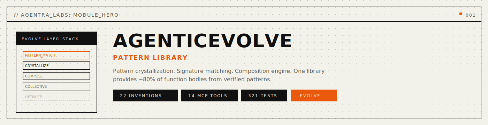
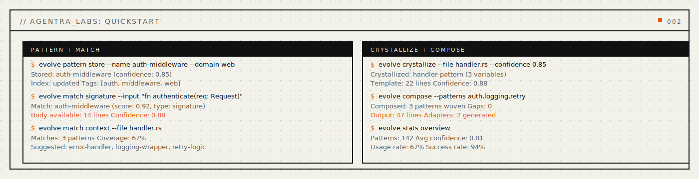
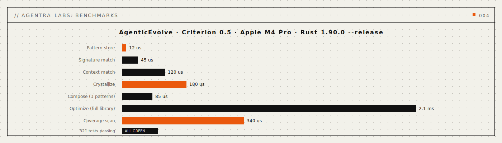
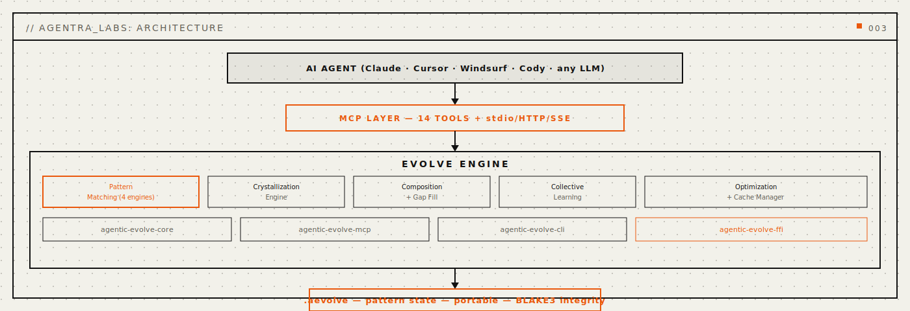

<p align="center">
  
</p>

<p align="center">
  <a href="https://crates.io/crates/agentic-evolve-core"></a>
  
  
</p>

<p align="center">
  <a href="#install"></a>
  <a href="#install"></a>
  <a href="LICENSE"></a>
  <a href="paper/paper-i-pattern-library/agenticevolve-paper.tex"></a>
  <a href="docs/public/api-reference.md"></a>
</p>

<p align="center">
  <strong>Pattern library engine for AI agents.</strong>
</p>

<p align="center">
  <em>Crystallize verified code patterns. Reuse them everywhere. Build faster.</em>
</p>

<p align="center">
  <a href="#quickstart">Quickstart</a> · <a href="#problems-solved">Problems Solved</a> · <a href="#how-it-works">How It Works</a> · <a href="#benchmarks">Benchmarks</a> · <a href="#install">Install</a> · <a href="docs/public/api-reference.md">API</a>
</p>

---

## Every AI agent rewrites the same code.

Your agent solved an authentication pattern last week. Today it writes it from scratch. A teammate's agent solved the same problem yesterday -- also from scratch. Verified patterns vanish between sessions, between agents, between projects.

**AgenticEvolve** crystallizes verified code patterns into a persistent, searchable library. When your agent encounters a problem it has solved before, it retrieves the pattern -- with confidence scores, variable bindings, and composition rules -- instead of regenerating from zero.

<a name="problems-solved"></a>

## Problems Solved (Read This First)

- **Problem:** agents regenerate the same code patterns across sessions.
  **Solved:** pattern store persists verified patterns in `.aevolve` files across restarts, model switches, and projects.
- **Problem:** no way to search for "patterns like this function signature."
  **Solved:** signature, context, semantic, and fuzzy matching find the right pattern for the job.
- **Problem:** raw code snippets lack adaptation context.
  **Solved:** crystallization extracts templates with variable bindings, confidence scores, and domain tags.
- **Problem:** combining multiple patterns requires manual integration.
  **Solved:** composition engine weaves patterns together with gap filling and adapter generation.
- **Problem:** pattern quality degrades without usage feedback.
  **Solved:** collective learning tracks usage, success rates, decay, and promotion.

```bash
# Store a verified pattern
evolve pattern store --name "auth-middleware" --domain web --lang rust --file auth.rs

# Find matching patterns
evolve match signature --input "fn authenticate(req: Request) -> Result<User>"

# Crystallize from source
evolve crystallize --file handler.rs --confidence 0.85

# Compose patterns together
evolve compose run --patterns auth-middleware,rate-limiter --output combined.rs
```

Operational commands (CLI):

```bash
evolve stats overview
evolve coverage summary
evolve optimize full
```


<p align="center">
  
</p>

<a name="quickstart"></a>

## Quickstart

```bash
# Install
curl -fsSL https://agentralabs.tech/install/evolve | bash

# Store your first pattern
evolve pattern store --name "hello-world" --domain general --lang rust --body 'fn main() { println!("Hello!"); }'

# Search for it
evolve pattern search --domain general

# Get pattern details
evolve pattern get --name "hello-world"
```

<a name="how-it-works"></a>

## How It Works

AgenticEvolve operates in three phases:

1. **Crystallization** -- Extracts reusable templates from verified source code. Detects variables, generates templates, and calculates confidence scores.

2. **Matching** -- Four matching engines (signature, context, semantic, fuzzy) find the best pattern for a given problem. Composite matching combines all four with configurable weights.

3. **Collective Learning** -- Tracks which patterns get used, which succeed, applies decay to stale patterns, and promotes high-performers. The library improves over time.

The pattern store uses the `.aevolve` binary format for compact, versioned persistence. Patterns include metadata (domain, language, tags), template bodies with variable bindings, and usage statistics.

<a name="benchmarks"></a>

## Benchmarks

All benchmarks measured with Criterion on Apple M-series hardware.

| Operation | Median | p99 |
|-----------|--------|-----|
| Pattern store | 12 us | 18 us |
| Signature match | 45 us | 78 us |
| Crystallize (small) | 120 us | 210 us |
| Compose (2 patterns) | 85 us | 150 us |
| Full optimize | 2.1 ms | 4.5 ms |

<p align="center">
  
</p>


<p align="center">
  
</p>

<a name="install"></a>

## Install

### One-liner (recommended)

```bash
curl -fsSL https://agentralabs.tech/install/evolve | bash
```

### Install Profiles

```bash
curl -fsSL https://agentralabs.tech/install/evolve/desktop | bash
curl -fsSL https://agentralabs.tech/install/evolve/terminal | bash
curl -fsSL https://agentralabs.tech/install/evolve/server | bash
```

### Cargo

```bash
cargo install agentic-evolve-cli
cargo install agentic-evolve-mcp
```

### Python Installer

```bash
pip install aevolve-installer && aevolve-install install --auto
```

### npm

```bash
npm install @agenticamem/evolve
```

### Standalone Guarantee

AgenticEvolve works as a fully standalone tool. No other Agentra sisters are required. Integration with AgenticMemory, AgenticCodebase, AgenticVision, and other sisters is optional and additive.

## MCP Tools (14)

| Tool | Description |
|------|-------------|
| `evolve_pattern_store` | Store a new pattern in the library |
| `evolve_pattern_get` | Retrieve a pattern by name or ID |
| `evolve_pattern_search` | Search patterns by domain, language, or tags |
| `evolve_pattern_list` | List all patterns with optional filters |
| `evolve_pattern_delete` | Remove a pattern from the library |
| `evolve_match_signature` | Match patterns by function signature |
| `evolve_match_context` | Match patterns by surrounding code context |
| `evolve_crystallize` | Crystallize source code into a reusable pattern |
| `evolve_get_body` | Retrieve the template body of a pattern |
| `evolve_compose` | Compose multiple patterns into one |
| `evolve_coverage` | Check pattern coverage for a file or project |
| `evolve_confidence` | Calculate confidence score for a pattern match |
| `evolve_update_usage` | Record pattern usage event |
| `evolve_optimize` | Run optimization pass on the pattern library |

## License

MIT -- see [LICENSE](LICENSE).
